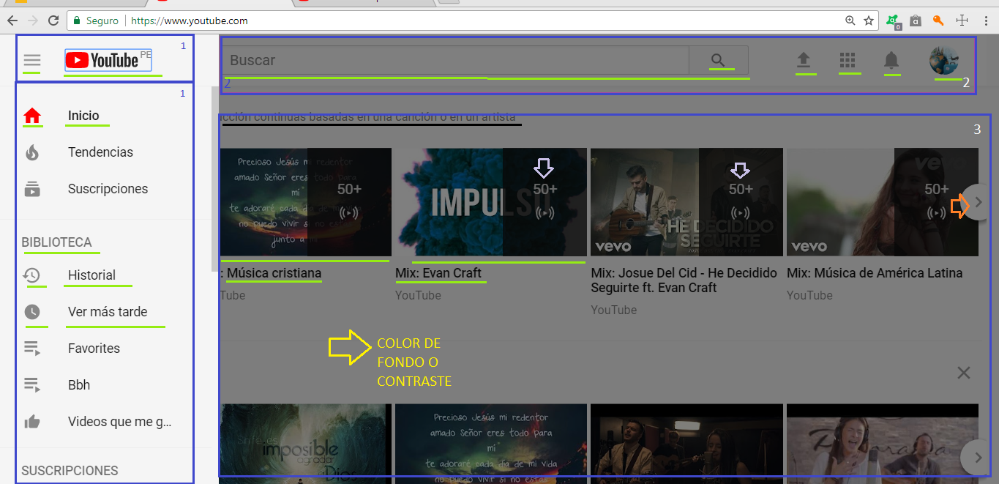

## PARTES QUE CONFORMAN UX Y UI EN UNA PAGINA WEB 

Antes de empezar con las partes que conforma un UX y UI en una pagina daré una breve definicion que es UX y UI.

#### UX
>" UX = User Experience son todas las experiencias que vive/experimenta una persona al usar un producto. Una silla, una mesa y un computador, todos tienen una experiencia al usarlos ".

#### UI  
>" UI = User Interface  es el diseño de la interfaz gráfica, a menudo sobre la interfaz web o una app en la parte visual es decir, colores e tamaños".

Ahora si a continuacion podremos ver  de manera visual las partes, cuales son UX y UI en la siguiente imagen pagina de YouTube.

En la imagen podemos notar los bordes o subrayados de colores indicare el color y los emnumerados a quien pertenece.

UX 

1.Bordes azules : es la parte del menu principal donde que el usuario puede interactuar e navegar en este caso puede ingresar a cualquiera de ellas a inicio ,ver sus suscripciones , historial de videos , videos favoritos  y todo lo que se visualiza en la columna 1 .

2.Bordes azules : En esta parte se encuentra el searh, perfil del usuario y otras secciones secundarias o adicionales que el usuario desee hacer.

3.Bordes azules : Aqui se encuentra el contenido principal que al usuario le interesa mas, los videos.

Subrayado negro : la parte contextual donde   te indica los videos relacionados o mas frecuente que vee el usuario.

Flecha Blanca : indicador del numero de videos relacionados.

Flecha Naranja : indicador que puedes deslizar a la siguiente y puedas ver mas videos relacionados.

UI 

Subrayado verde limon : son iconos, tipo de letra , tamaño de letra , tamaño de imagenes posiciones, bordes y colores.

Flecha amarilla : color de fondo o contraste que se ve al hacer click en el menu principal.

